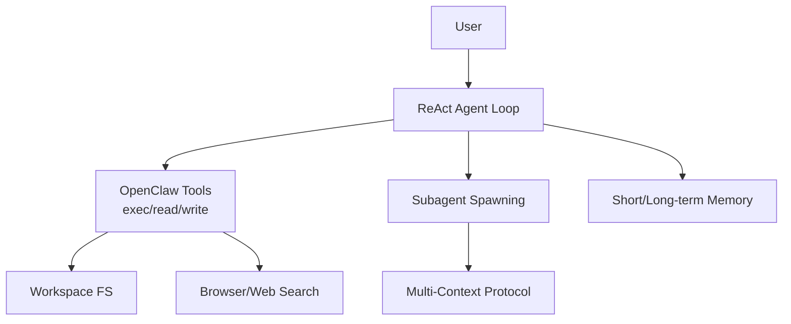

# SuperpowerAI Crashcourse 🦾

[](https://github.com/tiamatthei/superpowerai-crashcourse)
[](https://github.com/tiamatthei/superpowerai-crashcourse/network/members)
[](https://python.org)
[](https://nodejs.org)
[](LICENSE)
[](tests/)

<div align=\"center\">


**Domina Agentic AI en 2 semanas: De Python basics a OpenClaw production agents (2026-ready).**

Para devs/startups. OpenClaw tools, subagents, MCP patterns, production deploy.

</div>

## 🚀 Quickstart (2 min)

```bash
git clone https://github.com/tiamatthei/superpowerai-crashcourse
cd superpowerai-crashcourse
pip install -r requirements.txt  # or make setup
jupyter notebook examples/lesson_01_basics.ipynb
```

## 📚 Syllabus Detallado (16h total)

| # | Tema | ETA | Notebook | Key Skills | Recursos |
|---|------|-----|----------|------------|----------|
| 1 | [Python for AI](examples/lesson_01_basics.ipynb) | 2h | `lesson_01_basics.ipynb` | Pydantic, OOP, decorators | [Colab](https://colab.research.google.com/github/tiamatthei/superpowerai-crashcourse/blob/main/examples/lesson_01_basics.ipynb) |
| 2 | [Structured Outputs](examples/lesson_02_structured.ipynb) | 1.5h | `lesson_02_structured.ipynb` | Gemini JSON mode | [Prompting guide](docs/prompting.md) |
| 3 | [LangChain Tools](examples/lesson_03_langchain.ipynb) | 2h | `lesson_03_langchain.ipynb` | Tool calling, chains | [LangChain docs](https://python.langchain.com/docs/) |
| 4 | [Gemini Function Calling](examples/lesson_04_gemini.ipynb) | 2h | `lesson_04_gemini.ipynb` | Multi-tool agents | [Gemini API](https://ai.google.dev/gemini-api/docs) |
| 5 | [Agent Loops (ReAct)](examples/lesson_05_loops.ipynb) | 2h | `lesson_05_loops.ipynb` | Multi-turn reasoning | [ReAct paper](https://arxiv.org/abs/2210.03629) |
| 6 | **[OpenClaw Integration](examples/lesson_06_openclaw.ipynb)** | 2h | `lesson_06_openclaw.ipynb` | exec/read/write tools | [OpenClaw docs](https://openclaw.ai) |
| 7 | [Subagents + MCP 2026](examples/lesson_07_subagents.ipynb) | 2h | `lesson_07_subagents.ipynb` | Hierarchical agents | [MCP spec](docs/mcp.md) |
| 8 | [Production Deploy](examples/lesson_08_production.ipynb) | 2.5h | `lesson_08_production.ipynb` | Docker, CI/CD, tests | [Dockerfile](Dockerfile) |

## 🏗️ Architecture



## 🤖 OpenClaw Live Demo (Lección 6)

```python
from agents import Agent
from tools import openclaw_exec, read_file

agent = Agent(tools=[openclaw_exec, read_file])
response = agent.run('Lista archivos del workspace y resume README.md')
print(response)
```

## 📦 Installation

```bash
pip install -r requirements.txt
# Dev: pip install -r requirements-dev.txt
```

## ✨ Sponsors

[](https://github.com/sponsors/tiamatthei)

<a href=\"https://github.com/sponsors/tiamatthei?sponsor=tiamatthei\">
  
</a>

## 🤝 Contributing

See [CONTRIBUTING.md](CONTRIBUTING.md) • [CODE_OF_CONDUCT.md](CODE_OF_CONDUCT.md) • Report [Security Issues](SECURITY.md)

## 📄 License

MIT © [tiamatthei](https://github.com/tiamatthei)